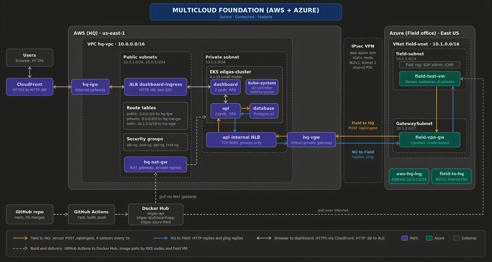

# Group 9 Capstone: Multi-Cloud Oil & Gas Pipeline Monitoring Platform

## Overview
A simulated field site on **Azure** sends pipeline sensor data over a
private **IPsec VPN** to **AWS**, where a Kubernetes app stores and
displays it on a public dashboard.

- **Field (Azure):** Linux VM running a Dockerized sensor app
- **Link:** AWS VPC <-> Azure VNet, IPsec site-to-site VPN
- **HQ (AWS):** EKS cluster running API, database, dashboard
- **Edge:** CloudFront (free HTTPS) in front of an AWS ALB created from the Kubernetes Ingress. No domain needed.
- **CI/CD:** GitHub Actions tests and pushes images to Docker Hub on merge to `main`. Manifests are applied with kubectl.
- **Build:** console build is complete and documented in `docs/`. A Terraform replica is planned on a separate branch to prove reproducibility.

See `docs/` for the architecture diagram, interactive walkthrough and presentation.	

## Architecture


## Repo Structure
```
api/                 API service (Flask, port 6000)
azure-field/         Sensor simulator (Dockerfile + script)
dashboard-app/       Dashboard service (port 5000)
db/schema.sql        Creates the readings table
k8s/                 Kubernetes manifests
aws/ azure/ vpn/     Terraform (aws and azure in progress, vpn planned)
.github/workflows/   CI/CD pipeline
docs/                Architecture diagram, interactive index.html, presentation deck
CONTRIBUTORS.md      Team members and roles
create_issues.sh     Creates the project issues
```

## Workflow
1. Pick up an Issue (labeled by phase: network, vpn, app, k8s, edge)
2. Branch: `<n>/<phase>-<short-task>`
3. Commit: `[phase] short description`
4. Open a PR, link the Issue (`Closes #<number>`)
5. Get at least 1 review before merging to `main`

## Team
See `CONTRIBUTORS.md`.

## Environment Variables

| Variable | Used By | Purpose | Set In |
|---|---|---|---|
| POSTGRES_USER | api, database | DB login username | k8s/db-secret.yaml (local only) |
| POSTGRES_PASSWORD | api, database | DB login password | k8s/db-secret.yaml (local only) |
| POSTGRES_DB | api, database | database name | k8s/db-secret.yaml (local only) |
| DB_HOST | api | database Service name | k8s/api.yaml env |
| API_URL | dashboard-app | API base address (http://api:6000) | k8s/dashboard.yaml env |
| API_URL | azure-field | full ingest URL (http://<NLB>:6000/api/ingest) | sensor container env |
| DOCKERHUB_USERNAME | GitHub Actions | Docker Hub login | GitHub Secrets |
| DOCKERHUB_TOKEN | GitHub Actions | Docker Hub auth token | GitHub Secrets |

`k8s/db-secret.yaml` is gitignored. Copy `k8s/db-secret.example.yaml` to `k8s/db-secret.yaml` and set real values.

## Setup Instructions

Prerequisites: git, Python 3.11+, Docker, aws-cli, az-cli, kubectl, eksctl, helm.
(terraform is needed only once the Terraform branch is merged.)

```
git clone https://github.com/Elixirman/oilgas-multicloud-monitor.git
cd oilgas-multicloud-monitor
```

Run each app locally (3 terminals):
```
cd api && pip install -r requirements.txt && python3 app.py
cd azure-field && pip install -r requirements.txt && python3 sensor_app.py
cd dashboard-app && pip install -r requirements.txt && python3 app.py
```
Open http://localhost:5000

## Deployment Instructions

Phase 1 - Networks: AWS VPC (public and private subnets, IGW, NAT, route tables, security groups) and Azure VNet (field-subnet, GatewaySubnet, NSG). CIDRs must not overlap.
Phase 2 - VPN: AWS virtual private gateway, customer gateway and VPN connection; Azure VPN gateway, local network gateway and connection. Use the same pre-shared key on both sides (avoid special characters such as `!`). Enable route propagation on both AWS route tables.
Phase 3 - Containers: images are built and pushed by `.github/workflows/ci-cd.yml`.
Phase 4 - Kubernetes:
- Create the EKS cluster with enough pod capacity (t3.small allows 11 pods per node).
- Install the AWS Load Balancer Controller (Helm) and metrics-server.
- Tag public subnets `kubernetes.io/role/elb=1` (two AZs) and private subnets `kubernetes.io/role/internal-elb=1`.
- Apply manifests in order:
```
kubectl apply -f k8s/db-secret.yaml
kubectl apply -f k8s/database.yaml
kubectl exec -i deployment/database -- sh -c 'psql -U "$POSTGRES_USER" -d "$POSTGRES_DB"' < db/schema.sql
kubectl apply -f k8s/api.yaml
kubectl apply -f k8s/api-internal.yaml
kubectl apply -f k8s/dashboard.yaml
kubectl apply -f k8s/ingress.yaml
kubectl apply -f k8s/hpa.yaml
```
Phase 5 - Edge: wait for the ingress ADDRESS (the ALB hostname). Create a CloudFront distribution with the ALB as origin: HTTP only, port 80, viewer policy "Redirect HTTP to HTTPS", cache policy CachingDisabled.
Phase 6 - Field sensor: on the Azure VM run the sensor container with `API_URL=http://<api-internal NLB hostname>:6000/api/ingest`, then confirm readings appear on the CloudFront dashboard.

## Troubleshooting

**VPN tunnel shows Down**
- Confirm the pre-shared key matches exactly on both sides
- Confirm IKE version and IPsec settings match on both gateways

**Tunnel is up but ping or replies fail**
- Enable route propagation on every route table the instance subnet uses
- Allow ICMP in the AWS security group and the Azure NSG (and the OS firewall on Windows)

**Pod stuck in Pending ("Too many pods")**
- Node pod limit reached. Scale the node group or use larger nodes

**ImagePullBackOff**
- Check the image name in the manifest matches Docker Hub (`oilgas-dashboard-app`)

**Pod stuck in CrashLoopBackOff**
- Run `kubectl logs <pod-name>` and `kubectl describe pod <pod-name>`
- Check the /health path and port match the probe config

**API returns 500 on /api/ingest**
- Check `kubectl logs deployment/api`. "relation readings does not exist" means db/schema.sql was not loaded

**Ingress has no ADDRESS**
- `kubectl describe ingress dashboard-ingress`. A 403 means the controller IAM policy is outdated; "subnets count less than minimal" means two tagged public subnets in different AZs are needed

**HPA shows <unknown>**
- Set CPU requests on the deployments and confirm metrics-server is running

**ALB returns 502/503**
- Confirm the dashboard pods are Ready and the Service selector matches the pod labels

**Sensor cannot reach the API**
- `API_URL` for the sensor must include `/api/ingest`
- Confirm the NLB is internal and the VPN is up

**CI/CD pipeline failing on build-and-push**
- Confirm DOCKERHUB_USERNAME and DOCKERHUB_TOKEN are set in repo Secrets
- Confirm each app folder has a Dockerfile

## Known Limitations
- Postgres has no persistent volume; data is lost if the pod restarts
- db/schema.sql is loaded manually
- Single VPN tunnel and single NAT gateway (no failover)
- Flask development server and plain HTTP inside the VPN tunnel

See `docs/index.html` for the interactive walkthrough and `docs/Oilgas_Multicloud_Assessor_Deck.pptx` for the presentation.

## Video walkthrough 
https://drive.google.com/drive/folders/1IVWVNGElAFVpcOV6H-k08_wABdnSHuJ6?usp=sharing
