# Requirements Evidence

Each section shows what we built, where to find it in the repo, and the screenshot that proves it. Screenshots are in `docs/screenshots/`.

## 1. Architecture diagram
One diagram covers users, internet/network, cloud infrastructure, application components, database and the CI/CD pipeline.

| Required element | In our design |
|---|---|
| Users | Browser, HTTPS through CloudFront |
| Internet/network | CloudFront, ALB, internet gateway, NAT gateway, IPsec VPN |
| Cloud infrastructure | AWS VPC and EKS (HQ), Azure VNet and VM (Field) |
| Application components | dashboard, api, sensor |
| Database/storage | Postgres, `readings` table (`db/schema.sql`) |
| CI/CD pipeline | GitHub, GitHub Actions, Docker Hub |

Interactive walkthrough: `docs/index.html`

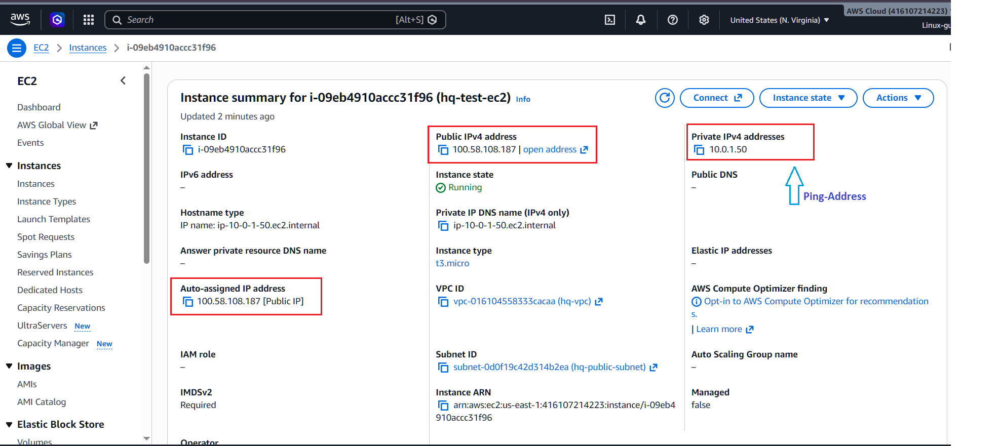
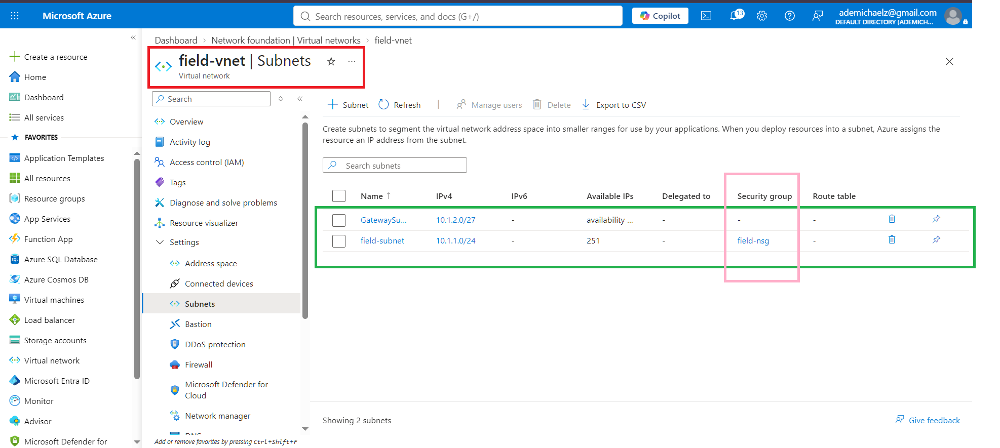
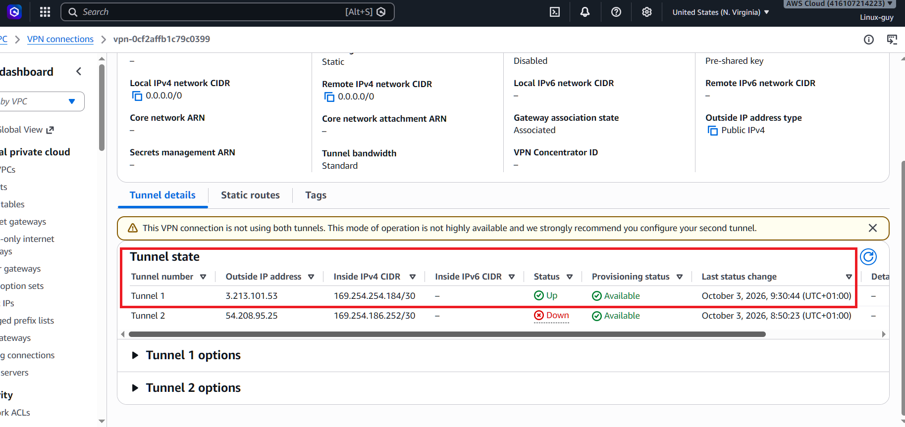
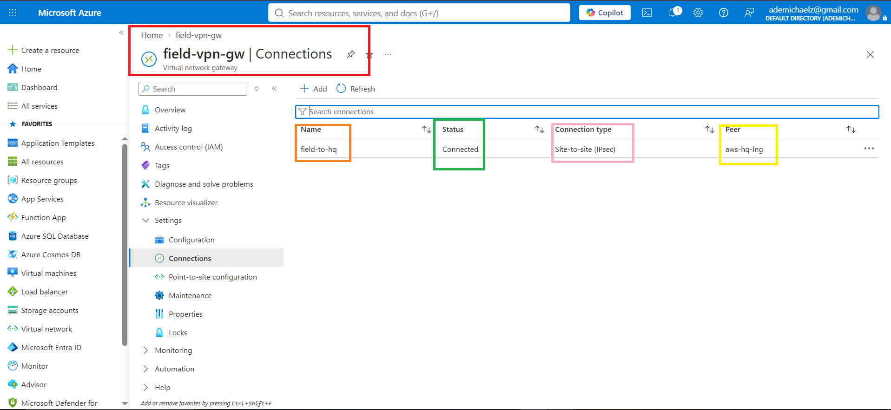

## 2. Source control
- GitHub repository: https://github.com/Elixirman/oilgas-multicloud-monitor
- Feature branches and pull requests merged into `main` (see screenshots). The workflow is described in the README.

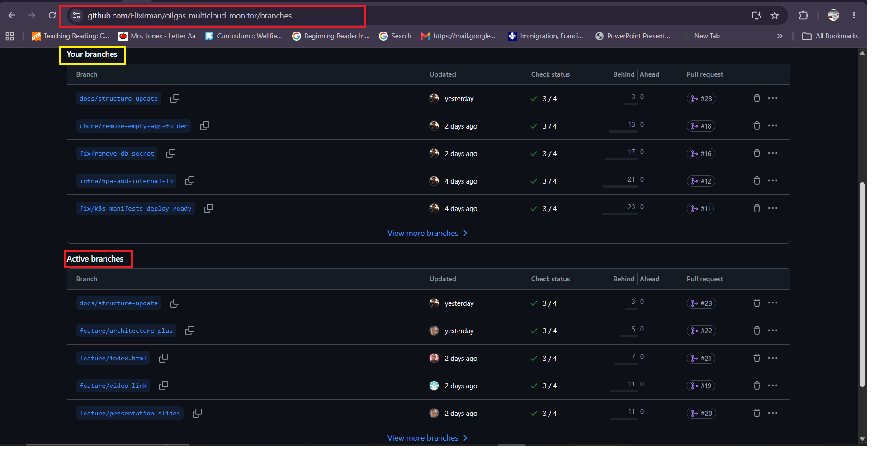
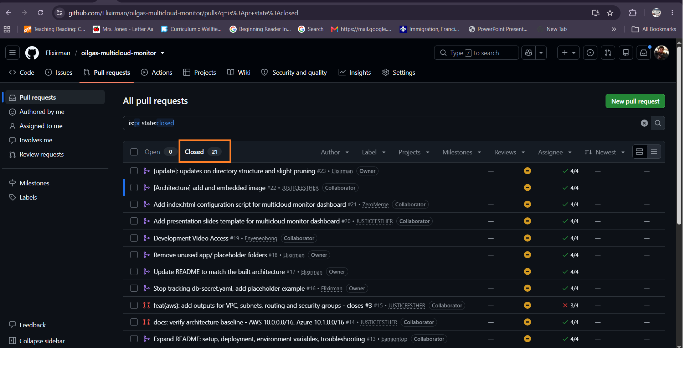

## 3. CI/CD
Pipeline: `.github/workflows/ci-cd.yml`
- **Automated tests:** pytest runs on every push and PR for each app that has a `test_app.py`.
- **Automated build and Docker images:** on merge to `main`, the pipeline builds and pushes three images to Docker Hub.
- **Deployment:** manifests are applied with `kubectl` in the order documented in the README. The pipeline stops at the image push.

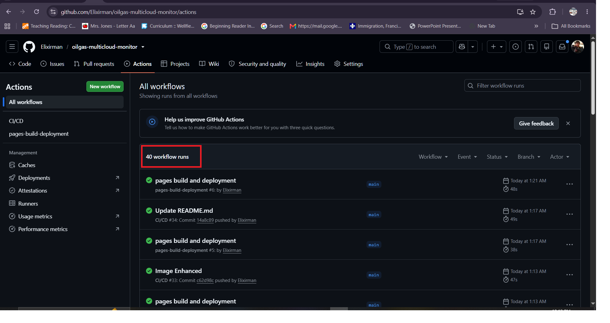
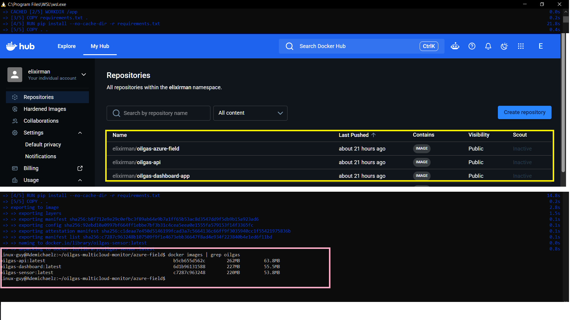
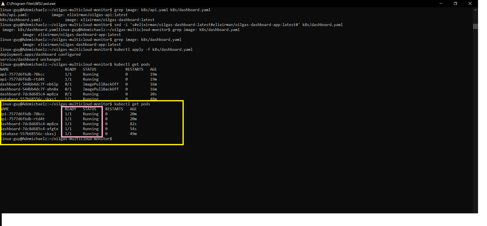

## 4. Security
- **No secrets in GitHub:** `k8s/db-secret.yaml` and `*.pem` keys are gitignored. Only `k8s/db-secret.example.yaml` (placeholders) is committed. Docker Hub credentials live in GitHub Actions secrets.
- **Note:** an early commit contained the real database secret. It was removed from tracking in PR #16, and the database it protected no longer exists.
- **Environment variables and secrets:** listed in the README (Environment Variables table).
- **IAM permissions:** the Load Balancer Controller uses its own role (IRSA) with `AWSLoadBalancerControllerIAMPolicy`. Worker nodes use `eks-node-role`. App pods call no AWS APIs, so they have no role. Azure SSH is limited to the admin IP by `field-nsg`.

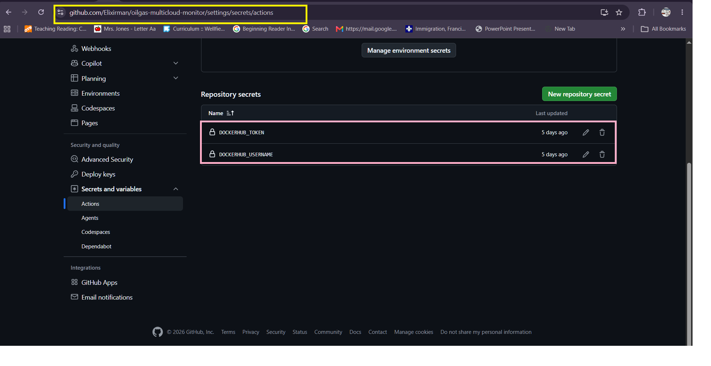
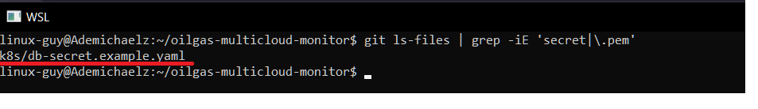

## 5. Monitoring
- **/health endpoint:** the api (port 6000) and dashboard (port 5000) both expose `/health`.
- **Container health:** Kubernetes liveness and readiness probes call `/health` every 10 seconds. The HPA and metrics-server track CPU.
- **Application logs:** read with `kubectl logs deployment/api`.

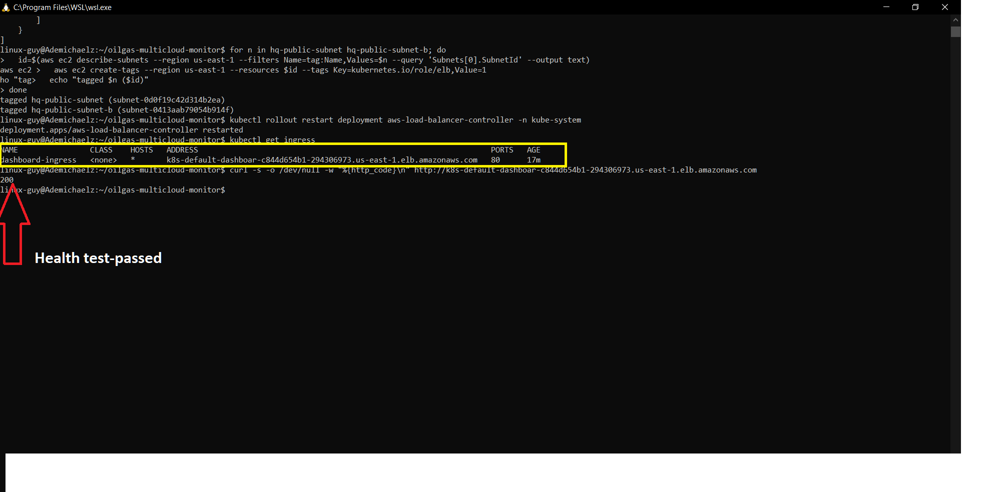
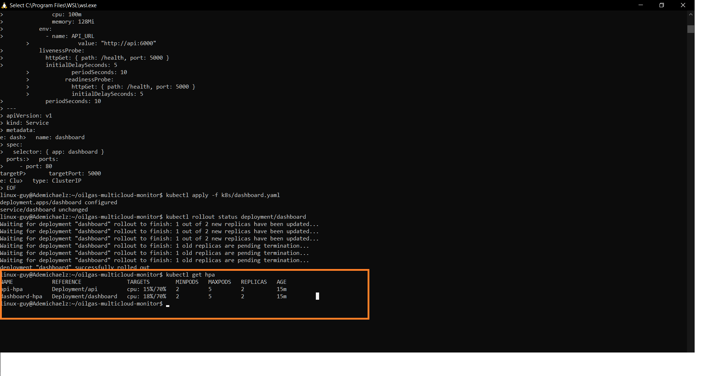

## 6. Documentation
All in `README.md`: architecture overview, setup instructions, deployment instructions, environment variables, troubleshooting and known limitations. The interactive walkthrough is `docs/index.html`.

## Proof it works
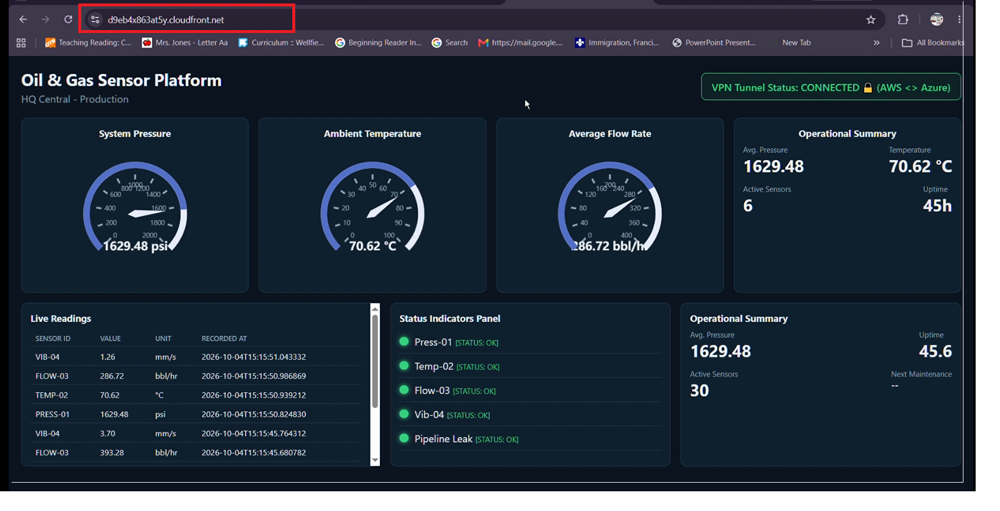
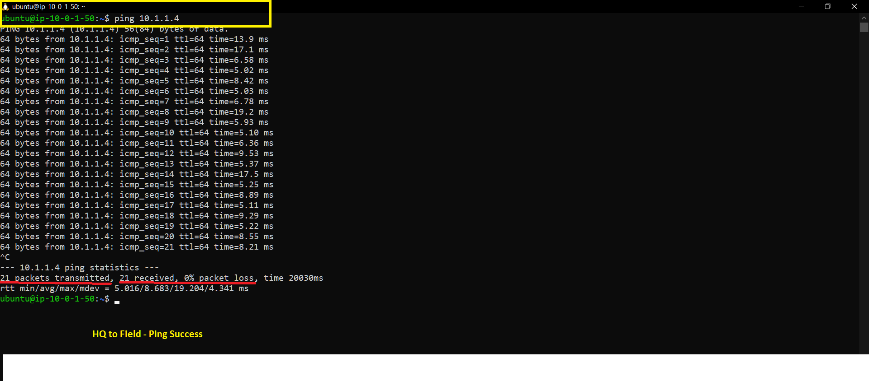
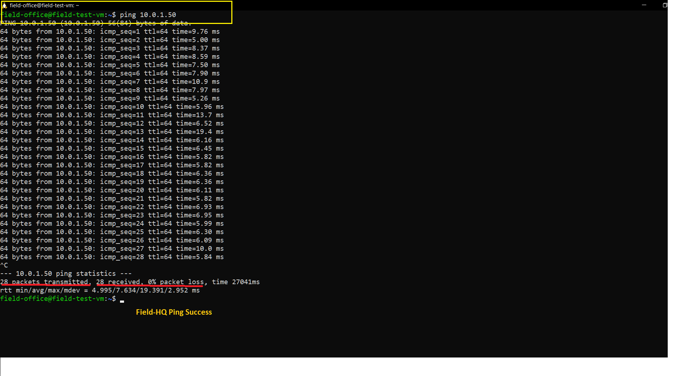
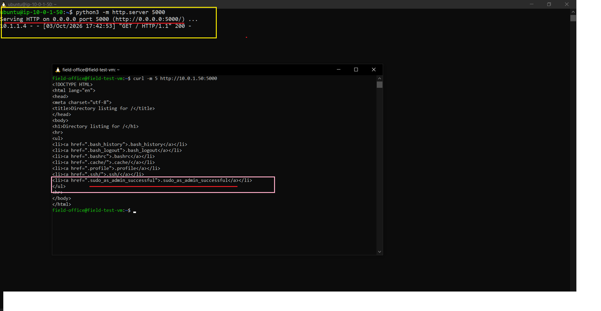
